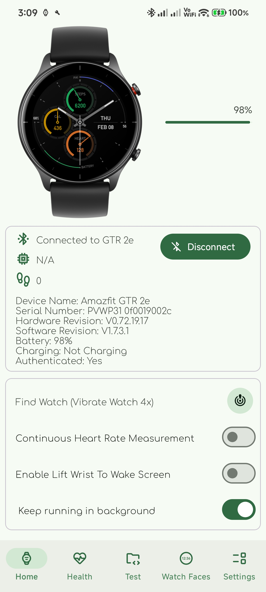
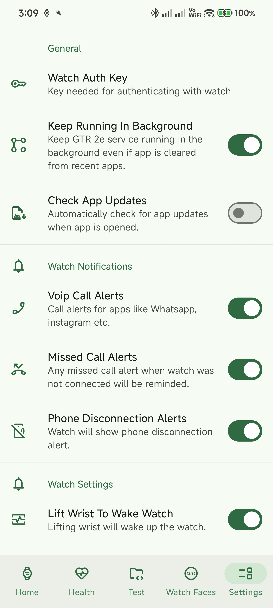
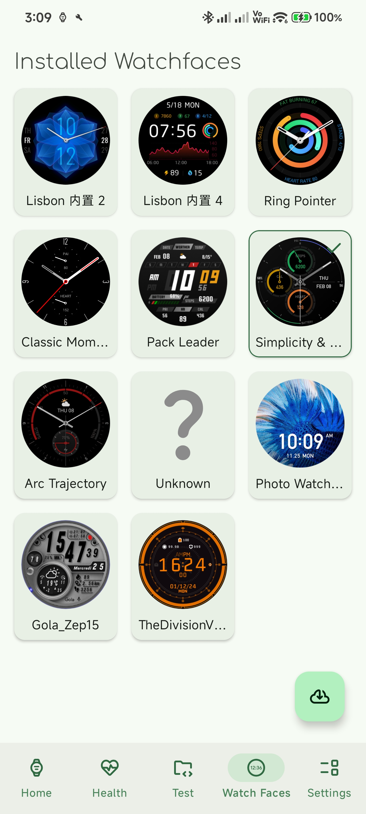

# GTR 2e Companion

A privacy-focused, open-source Android companion app for the Amazfit GTR 2e smartwatch, enabling seamless data synchronization and advanced device management.

## Overview

GTR 2e Companion provides a robust alternative to official applications for managing the Amazfit GTR 2e. By implementing the Huami Bluetooth Low Energy (BLE) protocol, the app offers core synchronization and control features with a commitment to simplicity, performance, and user privacy.

## 📸 Screenshots

  
  
  

## Key Features

- **Automated Authentication**: Optional Zepp account login is used to securely retrieve your device-specific `authKey` during initial setup, eliminating the need for manual token extraction tools.
- **Real-time Health Monitoring**: Synchronize and display live data including:
    - Step count and progress tracking.
    - Continuous or manual Heart Rate monitoring.
    - Battery status and charging indicators.
- **Advanced Device Control**:
    - Toggle "Lift Wrist to Wake" and customize sensitivity.
    - Remote "Find Watch" functionality.
    - Manage "Do Not Disturb" (DND) modes.
    - Time and Date synchronization.
- **Media & Notification Integration**:
    - **Music Control**: Full synchronization of media metadata (Artist, Album, Track) and playback state from your phone to the watch.
    - **Call Management**: Receive incoming call notifications on your wrist with the ability to reject or mute calls directly.
- **Reliable Background Sync**: A dedicated foreground service ensures a persistent connection for notifications and data updates without being killed by the OS.
- **In-App Updates**: Built-in update mechanism to ensure you are always running the latest version with improved stability and features.

> **Note**: This is an active project. **More features will be added one by one with each update**, expanding the capabilities of the app to provide a full-featured companion experience.

## Authentication Model

- **No Login Required for Core Features**: After initial pairing, the app communicates directly with the watch over BLE using a locally stored authentication key.
- **One-Time Login**: Zepp account login is only required once during setup to retrieve the device authentication key 
> Only required if login method is choosen else user provided key is used and login is skipped.
- **Optional Cloud Features**: Login may also be used for optional features such as watchface metadata and downloads.
> These features are disabled if login is skipped. Some cloud features such as firmware and agps update do not require login.

The app continues to function offline after initial setup.
- Authentication tokens are stored securely using Android’s encrypted storage mechanisms.
- User credentials are never stored locally.
- Sensitive data such as tokens are never logged or transmitted outside official endpoints.

## Technical Details

The application is built using modern Android development practices:
- **BLE Stack**: A robust queue-based BLE operation manager to handle reliable communication with the watch.
- **Foreground Service**: Ensures long-running operations and connectivity are maintained.
- **Huami Protocol**: Full implementation of the 2021 variant of the Huami chunked transfer protocol for complex data types like music metadata.
- **Security**: Secure handling of authentication challenges and AES-based encryption for the pairing process.

## Acknowledgements & Credits

This project stands on the shoulders of giants in the open-source community. Special thanks to:

- **[Gadgetbridge](https://gadgetbridge.org/)**: For their invaluable work in reverse-engineering the Huami protocol. Significant portions of the BLE handling logic and protocol definitions are inspired by or adapted from the Gadgetbridge codebase and its contributors.
- **[HuaToken](https://codeberg.org/argrento/huami-token/)**: For providing the methodology and inspiration for the Zepp cloud authentication and key retrieval logic. Check out the project for more technical details.

## License

This project incorporates code from Gadgetbridge, which is licensed under the [GNU Affero General Public License v3.0](https://www.gnu.org/licenses/agpl-3.0.en.html). Accordingly, this project is also subject to the terms of the AGPL-3.0.

## Disclaimer

**This is an unofficial open-source client for the Amazfit GTR 2e device.**

- **Technical Basis**: This application uses reverse-engineered BLE protocols and private Zepp APIs. These APIs may change or stop working at any time.
- **Affiliation**: This project is not affiliated with, authorized, maintained, sponsored, or endorsed by Amazfit or Zepp Health.
- **Data Privacy**: We do not save any of your data in the cloud. All your data is saved locally on your phone and is cleared/lost when the app data is cleared or the app is uninstalled.
- **Usage**: This software is provided "as is", without warranty of any kind. Use at your own risk.
- **Resilience**: Core functionality (device connection, control, and synchronization) continues to work even if Zepp APIs are unavailable.

## Why This Project Exists

This project aims to provide a transparent, privacy-respecting alternative to proprietary companion apps, giving users full control over their device without unnecessary cloud dependencies.